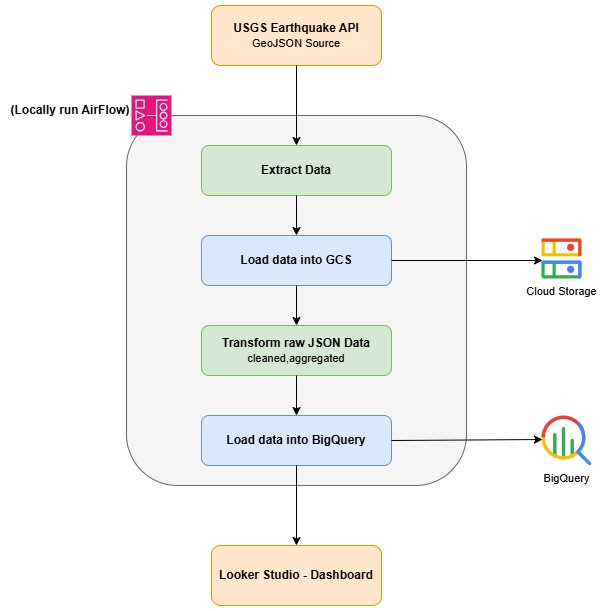

# Earthquake ETL Pipeline — USGS → GCP

A hands-on data engineering project that builds an end-to-end **ETL pipeline**: it extracts earthquake data from the public USGS API, stages the raw response, transforms it into clean analytics-ready tables, and loads it into a data warehouse for visualization. The whole flow is orchestrated with **Apache Airflow** running locally, and lands in **Google Cloud Platform**.

The goal is to practice the core skills of the job — writing modular ETL tasks, orchestrating them as a DAG, handling nested JSON, and separating a raw staging layer from a clean serving layer.

## Architecture

Data flows top to bottom. Everything inside the rounded container is a task in a single Airflow DAG running on the local machine; the USGS API above it and Looker Studio below it are external systems the DAG talks to but does not run.

## How it works

1. **Extract** — Pull earthquake events from the USGS Earthquake API as GeoJSON. The request is time-parameterized (`starttime` / `endtime`) and wired to the DAG's run date, so each run pulls its own window and historical backfills work for free.
2. **Load to GCS** — Write the raw, untouched GeoJSON to a Cloud Storage bucket. This acts as a replayable checkpoint: if the transform logic changes, it can be re-run against the saved raw file without re-hitting the API.
3. **Transform** — Flatten the nested GeoJSON into tabular rows, convert epoch-millisecond timestamps, unpack the coordinate array, derive fields (e.g. magnitude class), and aggregate.
4. **Load to BigQuery** — Load the cleaned data into serving tables/views, using idempotent merges on the stable event `id` so re-runs don't create duplicates.
5. **Visualize** — A Looker Studio dashboard reads only the curated BigQuery tables to display quakes on a map, magnitude over time, and regional rollups.

## Tech stack

| Layer | Tool |
|---|---|
| Data source | USGS Earthquake API (GeoJSON, no auth) |
| Orchestration | Apache Airflow (run locally) |
| Raw storage | Google Cloud Storage (GCS) |
| Data warehouse | Google BigQuery |
| Dashboard | Looker Studio |
| Language | Python |

## Data source

The [USGS Earthquake Catalog API](https://earthquake.usgs.gov/fdsnws/event/1/) is a free, public, key-less endpoint that returns earthquake events as GeoJSON. Requests can be filtered by time window, magnitude, and more — which makes it well suited for scheduled, incremental extraction.

## Project status

🚧 Work in progress — building out the pipeline task by task.

## Cost

The project is designed to run within GCP's Always Free tier (BigQuery: 10 GB storage + 1 TB queries/month; GCS: 5 GB). Earthquake data volume is tiny, so it stays comfortably inside those limits. Airflow runs locally rather than on Cloud Composer to avoid managed-service costs.
